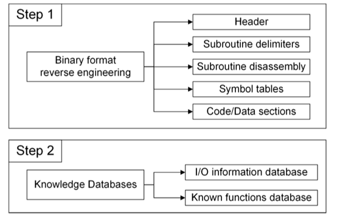
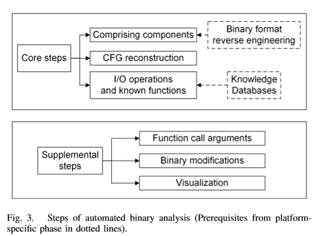
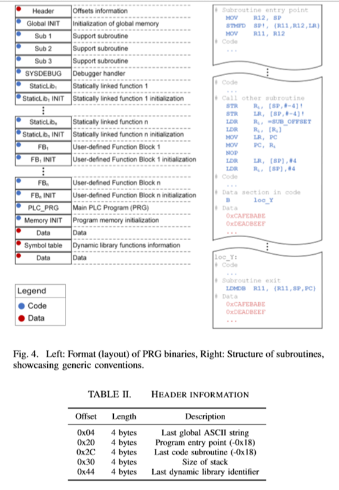
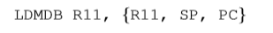
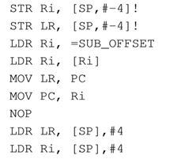
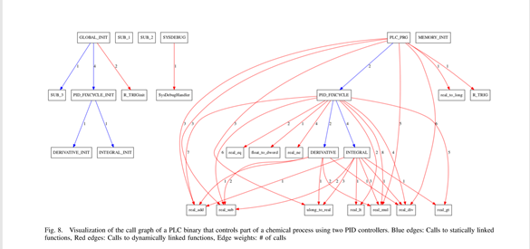

## 介绍
解决ICS逆向问题，为ICS二进制文件提出结构化的方法考虑ICS特定领域的特征，自动逆向引擎

论文中文翻译

### 目的
逆向编译后的CODESYS

### 所做工作
- 用自己开发的ICSREF逆向了CODESYS编译后的二进制文件。
- 创建了一个PLC数据库，为了评估PLC逆向框架的好坏：对很多行业的PLC文件都能很好的处理。
- 用商业智能手机自动生成payload自动化地进行攻击。

### 逆向的工作
- 针对CODEDSYS架构逆向，并完全重建CFG图
- 创建了PLC源码库，收集了一些PLC源代码。
- 动态生成payload自动攻击

### PLC特点

- PLC二进制文件的执行模型又扫描周期决定，无限的执行三个步骤，这可能会妨碍对真个PLC二进制文件的动态分析因此需要为各个动态分析指定适当的代码段。
- I/O操作很重要，需要知道详细细节
- PLC有自己定义的可执行文件格式，需要知道详细细节。
- PLC编译器很少做优化有利于逆向

## 需求与设计

### Binary format reverse engineering

ICS二进制文件使用专有的，未被记录的二进制文件，首先需要理解文件格式，提取格式的信息，没有针对未知文件格式逆向的确定方法，但是来自嵌入式系统固件逆向工程和文件格式分析等领域的逆向工程技术可以在此步骤中提供帮助[8],[48],[11]

第二个难点是二进制文件的执行模型，无线的循环执行使得不能对整个二进制文件进行动态分析，而是对指令适当的划分。

PLC缺少优化对逆向分析有利

In general, the results of the binary format reverse engineering step should include information on header contents, how subroutines are delimited, extraction of the subroutines and their disassembly listings, identification of symbol tables and dynamically linked functions, as well as information on code and data sections.（二进制格式逆向工程步骤的结果应包含一下内容：标头内容，如何分割子例程，提取子例程及其反汇编列表，标识符号表和动态链接的函数以及有关代码和数据的信息）

### Knowledge Databases:
需要创建两个包含一般信息的只是数据库，这些数据能够并且加速逆向工程任务。
1.包含I/O信息：包含二进制文件如何从/到物理I/O读/写信息的
2.包含二进制文件代码片或函数的签名：能识别出在二进制文件中的已知子例程，包括标准函数和静态链接库有关的信息。（**IDA Pro反编译器的F.L.I.R.T技术[18]**）

###  Automated binary analysis

三个核心步骤
- 利用前一阶段得到的信息格式分解不同的组件(不同的段)：分割和反汇编子过程，识别代码段/数据段和已识别动态链接函数的符号表(导入表)
- 通过寻找和解析分支目标尽可能恢复完整的CFG图
- **使用知识数据库识别导致I/O操作的指令并为已知函数标注指纹**

增加步骤
- 函数参数识别：使用动态二进制分析技术和符号执行找到函数参数，参数能能够用来提取关于PLC二进制文件所控制物理环境的语义信息。
- 修改二进制文件：用于payload自动生成或者基于主机的防御。需要考虑文件完整性

## 具体实现

### PRG文件结构分析

右边的子例程部分是代码段紧跟函数段。

下面表是一些重要字段的偏移和大小。
0x50是header结束的地方也是Global INIT开始的地方

#### 头
第一个80字节构成了包含常规信息的标头。重要信息在上表之中。

例：通过标头内偏移量0x20处的4个字节值加上0x18即可获得程序入口点。

#### 子例程边界

关键点在子程序入口和出口的指令序列

子程序开始的汇编指令

子程序结束的汇编指令

二进制文件缺乏优化使得这些分隔表之对所有arm编译的二进制文件都是唯一和通用的

#### 初始化全局变量和生成子例程
第一个子例程(Global INIT)开始于偏移0x50，这个子例程设置常量，变量，初始化函数，VAR_GLOBAL段中定义的函数。PLC程序员通常用这个段来定义有关被物理环境控制的项目里的常量。

#### 静态链接库和用户定义函数块
每个静态链接函数或者块包括两个子例程，一个执行它的功能StaticLib（代码），一个初始化它的本地内存（StaticLib INIT），FB段对应StaticLib段对应用户定义函数。第二个子例程是主函数，名为PLC_PRG,作为扫描周期的起点

#### 符号表

结构如图，一null结尾的字符串，后面跟两个字节的数据通过这两个字节计算出实际的偏移

#### I/O数据库

为了与环境交流，物理的I/O模块被映射到PLC的内存，0x28CFEC00 - 0x28CFF7F8是I/O设别的地址空间

TRG文件包含PLC的硬件选项，保存在IDE安装目录，使用2048位固定数据进行异或方式进行编码并且和供应商以及目标PLC无关。TRG文件可以为PLC模型提取I/O内存映射

#### 已知函数数据库

为每个静态链接函数创建指纹，签名方案是每个子例程汇编指令助记符的SHA-256（只是用助记符，不用操作数，因为操作数可能改变）。

这里能这样用是因为编译器很少对代码进行优化。

#### 自动化二进制文件分析

##### 组成元素
- 1、解析头，提取头部信息
- 2、扫描二进制文件子例程边界，生成子例程，用radare2生成反汇编列表
- 3、提取符号表识别所有动态链接函数。

##### 重建CFG

包含解析每个子例程内部所有的分支以及从一个子例程跳转到另一个子例程。难点是解析间接分支（间接跳转？？）但是PGR只包含一个子例程到另一个子例程或动态链接函数的间接分支，并且跳转目标在二进制文件里。
调用子例程或动态链接函数会有下面的指令

所有的跳转目标(SUB_OFFSET)都在一个内存中一个调用表内，调用表能够重建

和符号表类似具体的索引值是两字节数值(0x82)\*4+8的结果。

call table是在codesys运行时在最后一个子例程Memory INIT运行后创建的，这个子例程的功能也是二进制文件的入口点。Memeory INIT会先对所需的内存空间进行0初始化，然后计算所有子例程的偏移建成调用表。

 **用angr实现对调用表的提取 [39], [42], [40]** 过程
实际上angr不能处理PRG格式的文件，作者通过手动的设置目标架构的信息并且设置入口点为Memory INIT解决这一问题。强制angr引擎在达到子例程出口点时停止，避免状态爆炸。
然后解析产生的符号状态内存提取子例程偏移量分配的所有索引，有效重构调用表。

##### I/O操作和已知函数匹配
使用I/O操作数据库取识别从/到物理I/O的读/写指令

用angr单独执行每个子例程，以检测内存映射I/O范围内的读写操作，用注释的形式进行展示。

使用只是数据库计算hash的方式对二进制子例程进行匹配然后修改子例程的名字

##### 函数参数模块

已经确定是栈传参。用angr来重建栈。考虑到参数可能是全局变量或常量符号执行需要执行Global INIT作为初始化。

然后转移执行调用者子例程，一直执行直到运行到感兴趣的函数为止。最终解析本地栈得到参数（实际上作者并没有实现所有函数的参数获取，这里仅仅实现了一个函数，估计应该是运行时间的问题）

##### 二进制修改模块
修改原来二进制文件的任意内容，修改为指定值。实例包括修改分支，通过修改死代码注入可执行代码，以及修改关键函数的参数。

CODESYS使用校验和文件(CHK)来保证文件的完整性。CHK文件存放PRG文件所有字节的累加

#### 可视化

每个子例程为一个顶点，权值为调用次数，蓝色便边为静态链接，红色边为动态链接。

