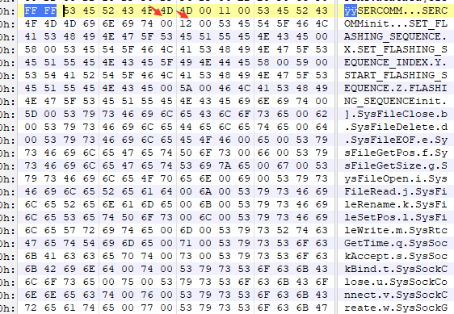

# PLC文件逆向，ICSREF分析
## PLC文件格式（仅限CODESYS）

上图所示，程序分成了一些段，除了sub这些函数其余都是为正常加载编译器所添加的模块以及数据

右边图展示了汇编指令的格式，每一段代码（每个函数）后面都是跟着一组数据的(这个可以通过后面的代码印证，这段数据应该就是这个函数正常运行需要的数据)

console函数获取命令行参数


```pyhton
analyze /home/tower/host/tower/work/ICSREF/samples/PRG_binaries/GitHub/91.PRG
```
命令会进行分析，分析的主要流程为PRG_analysis.py文件的init函数，do_analyze函数对命令行参数进行过滤核心函数为self.prg = Program(filename)

## analysis过程
Program类在PRG_analysis.py文件 接下来讲解__init__函数流程

函数可以按照小段字节序从二进制文件取数据
	
被标注的数据将会变为0x3e258

首先获取文件的头信息，包含
- program_start: Offset of program entry point

- program_end: Offset of program end

- dynlib_end: Offset of end of dynamic library strings 动态链接字符串结束的偏移（就是导入表的结束）

``` python
 self.program_start = struct.unpack('I', self.hexdump[0x20:0x20+4])[0] + 24#项目的开始地址

        # ROM:0000002C: End of OUTRO? + 0x18 (==24)

        self.program_end = struct.unpack('I', self.hexdump[0x2C:0x2C+4])[0] + 24#项目结束地址

        # ROM:00000044: End of dynamic libs (Before SYSDBGHANDLER)

        self.dynlib_end = struct.unpack('I', self.hexdump[0x44:0x44+4])[0]#动态链接库的结束地址？？？

        print('DONE: Header analysis')

```

然后是对字符串的分析

I/O的分析

函数界限和函数内容的分析

动态链接库函数的分析和静态链接库的函数分析

``` python
# Program strings

        self.strings = self.__strings()#找到所有连续4或4个字节以上的字符串

        print('DONE: String analysis')


        # I/O analysis from trg file

        self.__find_io()#找到IN和OUT段的开始地址和大小从全文搜索这个字符串

        print('DONE: I/O analysis')


        # Function Boundaries

        self.FunctionBoundaries = self.__find_blocks()#根据编根据特定汇编指令匹配

        print('DONE: Find function boundaries')


        # Program functions

        self.Functions = []

        

        self.__find_functions()

        print('DONE: Function disassembly')

        

        # Find all static and dynamic libraries and their offsets#动态库和偏移

        # Dynamic libraries

        self.dynlibs_dict = self.__find_dynlibs()

        print('DONE: Find dynamic calls')


        # Static libraries

        self.statlibs_dict = self.__find_statlibs()

        print('DONE: Find static calls')

        

        # All libraries: Add dynamic and static calls

        self.libs_dict = self.dynlibs_dict.copy()

        self.libs_dict.update(self.statlibs_dict)

        

        # Find library calls for each function

        self.__find_libcalls()

        print('DONE: Call offsets renaming')


        # Save object instance in file

        self.__save_object()


```


## 分析字符串

正则匹配找到所有连续4个活4个字节以上的所有字符串

``` python
p=re.compile('([ -~]{4,})')
```
正则匹配：[]表示里面的选一个（选的数据的ascii码在空格和\~之间，包含所有可见字符）
{}表示匹配次数{4,}是至少出现四次，{4}是精确出现4次


## I/O分析

找到IN和OUT的开始地址和大小（CODESYS定义的I/O地址范围是已知的）然后从二进制文件全文扫描包含这个数字（这里当作字符串来匹配的）的内容

具体的匹配：得到input所在的偏移和size之后，从偏移开始，每次指针移动一个字节，每次从指针处取出来一小端字节序的形式取出来四个字节，在全文进行匹配。
``` python
   def __find_io(self):

        """

        Find program INPUTS and OUTPUTS based on TRG information


        Assumes I/O memory locations will appear as direct offsets in the program

        and are kind of unique


        """


        # Read data from TRG file

        with open(trg_file, 'r') as f:

            trg_data = f.readlines()

        # Search for hex

        hex_pattern = re.compile('([0-9a-fA-F])*')#*表示出现任意次

        # Find input_start, output_start, input_size, output_size

        for line in trg_data:#得到地址

            if 'BaseAddressOfInputSegment' in line:

                input_start = re.search(hex_pattern, line.split('=')[1].replace('16#','')).group(0)

                input_start = int(input_start, 16)

            if 'BaseAddressOfOutputSegment' in line:

                output_start = re.search(hex_pattern, line.split('=')[1].replace('16#','')).group(0)

                output_start = int(output_start, 16)

            if 'SizeOfInputSegment' in line:

                input_size = re.search(hex_pattern, line.split('=')[1].replace('16#','')).group(0)

                input_size = int(input_size, 16)

            if 'SizeOfOutputSegment' in line:

                output_size = re.search(hex_pattern, line.split('=')[1].replace('16#','')).group(0)

                output_size = int(output_size, 16)


        # Find inputs/outputs offsets in the code

        self.inputs = {}

        self.outputs = {}

        for i in range(input_start, input_start + input_size, 1):

            #struct.pack('<I', i)的作用是把i变成小端字节序4字节

            match = self.__allindices(self.hexdump, struct.pack('<I', i))#遍历二进制文件找到子串

            if match:

                self.inputs[hex(i)]=[hex(k) for k in match]

        for i in range(output_start, output_start + output_size, 1):

            match = self.__allindices(self.hexdump, struct.pack('<I', i))

            if match:

                self.outputs[hex(i)]=[hex(k) for k in match]

        return 0
```


## 函数边界的分析 __find_blocks

按照CODESYS编译器的调用约定生成的特定字节码（就是特定的汇编指令）进行匹配，实际上常规的二进制文件不能这样分析的PLC能这样匹配是因为它很少进行优化

 0D C0 A0 E1 00 58 2D E9 0C B0 A0 E1对应着一个函数开始的汇编指令，每个函数的开始都是这个（用来保存调用前的变量信息）
 
 一个函数结束对应00 A8 1B E9 是一组汇编指令，用于在调用函数结束要返回时恢复变量信息。
 
` endings = [i+4 for i in endings]`让i指向了函数的结尾(在最终回复完了调用前变量信息之后)
``` python
 def __find_blocks(self):

        """

        Finds binary blobs (routines) based on the following delimiters:

         

        START: 0D C0 A0 E1 00 58 2D E9 0C B0 A0 E1


        STOP:  00 A8 1B E9


        """


        # Matches the prologue

        prologue = '\x0d\xc0\xa0\xe1\x00\x58\x2d\xe9\x0c\xb0\xa0\xe1'

        beginnings = self.__allindices(self.hexdump, prologue)

        # Matches the epilogue

        epilogue = '\x00\xa8\x1b\xe9'

        endings = self.__allindices(self.hexdump, epilogue)

        endings = [i+4 for i in endings]


        return zip(beginnings, endings)
```

## 分析函数的内容 __find_functions

``` python
 r2=r2pipe.open(self.path)#radare加载

        # Set r2 architecture configuration - Processor specific

        r2.cmd('e asm.arch=arm; e asm.bits=32; e cfg.bigendian=false')#设置为arm架构小端字节序，32位
```
首先进行反汇编：使用radare进行分析，但是原始文件radare不能分析，这里需要对radare先设置

`e asm.arch=arm; e asm.bits=32; e cfg.bigendian=false`设置为arm架构32位小端字节序。

然后进行反汇编

``` python
            start_code = self.FunctionBoundaries[i][0]

            # Stop: LDMDB

            stop_code = self.FunctionBoundaries[i][1]

            length_code = stop_code - start_code

            disasm_code = r2.cmd('b {}; pD @{}'.format(length_code ,start_code))

            # Add spaces for formating purposes and consistency in disassembly string

            disasm_code = (12 * ' ' + disasm_code).split('\n')

            # Add data

            # Start at code stop

            start_data = stop_code
```
接下来取出来本函数下面，下一个函数前面中间的部分作为数据，运行效果如下图所示

``` python
if i == len(self.FunctionBoundaries)-1:

                stop_data = self.program_end

            else:

                stop_data = self.FunctionBoundaries[i+1][0]

            length_data = stop_data - start_data

            # Data disassembly

            disasm_data = r2.cmd('pxr {} @{}'.format(length_data ,start_data))

            disasm_data = disasm_data.split('\n')
```

`'b {}; pD @{}'.format(length_code ,start_code`b设置要分析的块大小，pD输出汇编指令。

`pxr {} @{}'.format(length_data ,start_data)` 得到数据的地址如下图


然后Function提取助记符进行取hash256。


## 匹配动态链接库
找到导入表，取出来函数和偏移。

从文件的开始进行扫描，找到`\xff\xff`字符（导入表是用这两个字节作为开始的），导入表结束位置为前面找到的偏移(这个偏移存放的位置是固定的)
``` python
  offset = self.dynlib_end

        # Reverse find 0xFFFF (offset for the beginning of strings)

        dynlib_offset = self.hexdump.rfind('\xff\xff',0,offset) + 2#offset为结束地址  查找\xff\xff

        dynlibs = {}
```


然后对导入表进行处理
``` python
 dynlib = re.search('[ -~]*', self.hexdump[dynlib_offset:]).group(0)

        # Find the offsets to dynamic libs

        while dynlib:

            dynlib_offset += len(dynlib) + 1

            temp = self.hexdump[dynlib_offset:dynlib_offset+2].encode('hex')#取出index

            jump_offset = int(''.join([m[2:4]+m[0:2] for m in [temp[i:i+4] for i in range(0,len(temp),4)]]),16) * 4 + 8#index*4+8

            dynlibs[jump_offset] = dynlib#字典存放

            dynlib_offset += 2

            dynlib = re.search('[ -~]*', self.hexdump[dynlib_offset:]).group(0)

        return dynlibs
```
导入表格格式如下

字符串+‘\x00’+index+“\x00”，实际计算偏移的方式为`index*4+8`计算结果存放到字典


```python
    def __find_dynlibs(self):

        """

        Finds dynamic libraries and their offsets

        """

        offset = self.dynlib_end

        # Reverse find 0xFFFF (offset for the beginning of strings)

        dynlib_offset = self.hexdump.rfind('\xff\xff',0,offset) + 2#offset为结束地址  查找\xff\xff

        dynlibs = {}

        # Match printable ASCII characters

        #aa=self.hexdump[dynlib_offset:]

        dynlib = re.search('[!-~]*', self.hexdump[dynlib_offset:]).group(0)

        # Find the offsets to dynamic libs

        while dynlib:

            dynlib_offset += len(dynlib) + 1

            temp = self.hexdump[dynlib_offset:dynlib_offset+2].encode('hex')

            jump_offset = int(''.join([m[2:4]+m[0:2] for m in [temp[i:i+4] for i in range(0,len(temp),4)]]),16) * 4 + 8

            dynlibs[jump_offset] = dynlib

            dynlib_offset += 2

            dynlib = re.search('[!-~]*', self.hexdump[dynlib_offset:]).group(0)

        return dynlibs

```


## 静态调用分析

用符号执行的方法解析内存中的call table 得到函数的真正偏移，运行结果如图


作者先替换了一些关键字节（为什么要修改成这样还不清楚）
把原始二进制文件中的\x00\x20\x00\x00 为\x00\x00\x00\x10 保存到临时文件

``` python
#blob	装载文件到内存中作为一个平坦的镜像	yes

        # custom_base_addr —— 使用的基地址

        # custom_entry_point —— 使用的入口点

        #custom_arch架构为ARMEL

        proj = angr.Project('temphexdump.bin', load_options={'main_opts': {'backend': 'blob', 'custom_base_addr': 0, 'custom_arch':'ARMEL', 'custom_entry_point':0x50}, 'auto_load_libs':False})

```
0x50是Global INIT的地址


设置PC指针指向entry_offset上面对entry_offset的定义为
 entry_offset = self.Functions[-1].start，从开始的PLC格式图可以看出来这里的entry_offset被赋值为Memory INIT
``` python
state = proj.factory.entry_state()

        state.regs.pc = entry_offset#pc指针指向函数的开始

        simgr = proj.factory.simulation_manager(state)

        # Initialize some (0xFF) mem locations so taht execution doesn't jump to end.

        #r0-r3    用作传入函数参数，传出函数返回值。在子程序调用之间，可以将 r0-r3 用于任何用途

        #设置r0寄存器指向内容的值

        for i in range(0,0xFF,4):

            simgr.active[0].mem[simgr.active[0].regs.r0 + i].long = 0xFFFFFFFF

        # Run the code to create the static offsets in memory

        simgr.explore(find=stop_offset)#stop_offset为函数结束地址

        statlibs = {}

        i = 0

        while len(statlibs) < len(funs) - 1:

            mem_val = state.solver.eval(simgr.found[0].mem[simgr.found[0].regs.r1 + i].int.resolved)

            if mem_val in funs:

                statlibs[i + 8] = 'sub_{:x}'.format(mem_val)

            i += 4

        os.remove('temphexdump.bin')

        return statlibs

```
## 找到调用的函数

如下图，用mov pc,r8实现函数调用，在0016地址处的0x1050指向的内容0x464就是要调用的函数的索引，这里的目的是找到对应的函数

首先找到调用函数的汇编指令，然后从这条汇编指令前面开始搜索找的有关从寄存器取数据的汇编指令，如下图，找到0019和0016两条汇编指令。 0016后面的0x464是0x1050地址处的四个字节值（这是radare2自动识别出来的）


``` python
 """

        Finds the calls from all functions (dynamic and static)

        """

        for func in self.Functions:

            for index, line in enumerate(func.disasm):

                # Jump register can be other than r8

                if 'mov pc, r' in line:#调用函数

                    i=3

                    # Go backwards until ldr r in line

                    while not re.search('ldr r[0-9], \[0x', func.disasm[index-i]):

                        i += 1

                    jump = func.disasm[index-i].split(';')[1].split('=')[1].rstrip()#找到地址的值上图的0x464

                    # Format jump address (if hex)

                    if '0x' in jump:

                        jump = int(jump, 16)

                    jump = int(jump)

                    # Annotate disassembly

                    lib_name = self.libs_dict[jump]#通过地址找到函数名

                    func.disasm[index] += '                  ; call to {}'.format(lib_name)#添加注释

                    if lib_name not in func.calls.keys():

                        func.calls[lib_name] = 1#设置权值

                    else:

                        func.calls[lib_name] += 1

        return 0
```

## 问题
### 问题1 避免angr路径爆炸爆炸  __find_statlibs

``` python
proj = angr.Project('temphexdump.bin', load_options={'main_opts': {'backend': 'blob', 'custom_base_addr': 0, 'custom_arch':'ARMEL', 'custom_entry_point':0x50}, 'auto_load_libs':False})

        state = proj.factory.entry_state()

        state.regs.pc = entry_offset#pc指针指向函数的开始

        simgr = proj.factory.simulation_manager(state)

        # Initialize some (0xFF) mem locations so taht execution doesn't jump to end.

        #r0-r3    用作传入函数参数，传出函数返回值。在子程序调用之间，可以将 r0-r3 用于任何用途

        #设置r0寄存器指向内容的值

        for i in range(0,0xFF,4):

            simgr.active[0].mem[simgr.active[0].regs.r0 + i].long = 0xFFFFFFFF

        # Run the code to create the static offsets in memory

        simgr.explore(find=stop_offset)#stop_offset为函数结束地址

        statlibs = {}

        i = 0

        while len(statlibs) < len(funs) - 1:

            mem_val = state.solver.eval(simgr.found[0].mem[simgr.found[0].regs.r1 + i].int.resolved)

            if mem_val in funs:

                statlibs[i + 8] = 'sub_{:x}'.format(mem_val)

            i += 4
```
这里为什么设置0xffffffff  

解释是Initialize some (0xFF) mem locations so taht execution doesn't jump to end.论文中也说  强制angr引擎在达到子例程出口点时停止，避免状态爆炸。 但是为什么这样设置能够让angr在达到程序出口点时停止还不知道

### 问题2 __find_statlibs

``` python
code_start = '\x00\x20\x00\x00'

        with open('temphexdump.bin', 'w') as f:#把原始二进制文件中的\x00\x20\x00\x00 为\x00\x00\x00\x10 保存到临时文件

            hexdump_mod = self.hexdump.replace(code_start, '\x00\x00\x00\x10')

            f.write(hexdump_mod)
```
复制一份文件把文件里的0x2000改为0x10000000为什么要这么做，不这么做会怎么样

### 问题3 __find_statlibs

``` python
simgr.explore(find=stop_offset)#stop_offset为函数结束地址

        statlibs = {}

        i = 0

        while len(statlibs) < len(funs) - 1:

            mem_val = state.solver.eval(simgr.found[0].mem[simgr.found[0].regs.r1 + i].int.resolved)

            if mem_val in funs:

                statlibs[i + 8] = 'sub_{:x}'.format(mem_val)

            i += 4
```
为什么要从r1取数据，这里是为了取call table