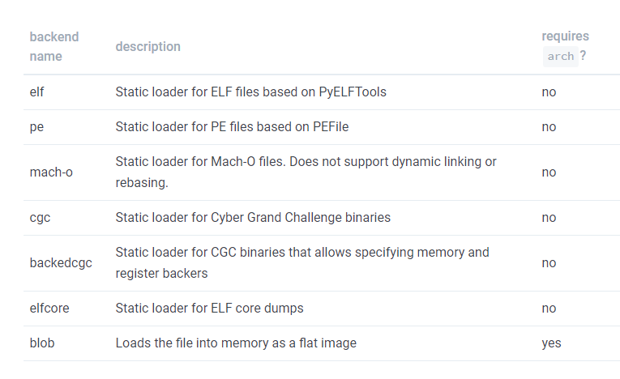

## 加载器

angr的加载模块叫CLE。

加载一个程序更深入的查看加载交互
``` python
>>> import angr, monkeyhex
>>> proj = angr.Project('examples/fauxware/fauxware')
>>> proj.loader
<Loaded fauxware, maps [0x400000:0x5008000]>
```
cle加载器(cle.Loader)i表示整个已加载二进制对象的组合，它们被加载并映射到单个内存空间。该加载器可以处理其文件类型（cle.Backend）例如cle.ELF用于加载ELF文件。

在内存中也会有一些对象与加载的二进制文件不对应，如用于提供本地线程存储支持的对象，以及用于提供未解析富豪的externs对象

用loader.all_objects能加载完整的CLE项目，以及一些有针对性的分类

``` python
# All loaded objects
>>> proj.loader.all_objects
[<ELF Object fauxware, maps [0x400000:0x60105f]>,
 <ELF Object libc-2.23.so, maps [0x1000000:0x13c999f]>,
 <ELF Object ld-2.23.so, maps [0x2000000:0x2227167]>,
 <ELFTLSObject Object cle##tls, maps [0x3000000:0x3015010]>,
 <ExternObject Object cle##externs, maps [0x4000000:0x4008000]>,
 <KernelObject Object cle##kernel, maps [0x5000000:0x5008000]>]

# This is the "main" object, the one that you directly specified when loading the project 。main是指定要加载的文件
>>> proj.loader.main_object
<ELF Object fauxware, maps [0x400000:0x60105f]>

# This is a dictionary mapping from shared object name to object  共享库有的名字和加载地址
>>> proj.loader.shared_objects
{ 'fauxware': <ELF Object fauxware, maps [0x400000:0x60105f]>,
  'libc.so.6': <ELF Object libc-2.23.so, maps [0x1000000:0x13c999f]>,
  'ld-linux-x86-64.so.2': <ELF Object ld-2.23.so, maps [0x2000000:0x2227167]> }

# Here's all the objects that were loaded from ELF files
# If this were a windows program we'd use all_pe_objects!
>>> proj.loader.all_elf_objects  #加载的所有elf文件，如果是windows把elf换成PE
[<ELF Object fauxware, maps [0x400000:0x60105f]>,
 <ELF Object libc-2.23.so, maps [0x1000000:0x13c999f]>,
 <ELF Object ld-2.23.so, maps [0x2000000:0x2227167]>]

# Here's the "externs object", which we use to provide addresses for unresolved imports and angr internals
>>> proj.loader.extern_object #externs object 对未解析的导入和angr自身提供的地址
<ExternObject Object cle##externs, maps [0x4000000:0x4008000]>

# This object is used to provide addresses for emulated syscalls
>>> proj.loader.kernel_object  # 为模拟系统调用提供的地址
<KernelObject Object cle##kernel, maps [0x5000000:0x5008000]>

# Finally, you can to get a reference to an object given an address in it
>>> proj.loader.find_object_containing(0x400000) #可以获得其中对给定地址对象的引用（给一个地址找到所在的对象）
<ELF Object fauxware, maps [0x400000:0x60105f]>
```
可以直接交互从它们提取元数据（刚被加载的时候的数据）

``` python
>>> obj = proj.loader.main_object

# The entry point of the object
>>> obj.entry  #对象的入口点（）
0x400580

>>> obj.min_addr, obj.max_addr  #最小和最大地址
(0x400000, 0x60105f)

# Retrieve this ELF's segments and sections
>>> obj.segments  #检索此ELF的段和节（内存大小，文件大小，虚拟地址，标志，偏移）
<Regions: [<ELFSegment memsize=0xa74, filesize=0xa74, vaddr=0x400000, flags=0x5, offset=0x0>,
           <ELFSegment memsize=0x238, filesize=0x228, vaddr=0x600e28, flags=0x6, offset=0xe28>]>
>>> obj.sections
<Regions: [<Unnamed | offset 0x0, vaddr 0x0, size 0x0>,
           <.interp | offset 0x238, vaddr 0x400238, size 0x1c>,
           <.note.ABI-tag | offset 0x254, vaddr 0x400254, size 0x20>,
            ...etc

#通过地址查看段和节
# You can get an individual segment or section by an address it contains:
>>> obj.find_segment_containing(obj.entry)
<ELFSegment memsize=0xa74, filesize=0xa74, vaddr=0x400000, flags=0x5, offset=0x0>
>>> obj.find_section_containing(obj.entry)
<.text | offset 0x580, vaddr 0x400580, size 0x338>

# Get the address of the PLT stub for a symbol
>>> addr = obj.plt['strcmp']# 得到一个符号的plt表项
>>> addr
0x400550
>>> obj.reverse_plt[addr]
'strcmp'

# Show the prelinked base of the object and the location it was actually mapped into memory by CLE
>>> obj.linked_base #一个对象的预链接基地址和实际上被CLE映射到内存中的位置
0x400000
>>> obj.mapped_base
0x400000
```

## Symbols and Relocations 符号和重定位

使用CLE的使用能用符号
loader.find_symbol可以返回一个符号对象（参数可以是符号名字或者地址）

``` python
>>> strcmp = proj.loader.find_symbol('strcmp')
>>> strcmp
<Symbol "strcmp" in libc.so.6 at 0x1089cd0>
```
描述一个符号又三个属性：名称，所有者和地址。但是地址可能不明确，有三种方式报告它的地址
- .rebase_addr   符号在全局地址空间的地址
- .linked_addr  相对于预链接及地址的偏移
- .relative_addr 相对于对象基地址的偏移，与RVA(相对虚拟地址类似)

``` python
>>> strcmp.name
'strcmp'

>>> strcmp.owner
<ELF Object libc-2.23.so, maps [0x1000000:0x13c999f]>

>>> strcmp.rebased_addr
0x1089cd0
>>> strcmp.linked_addr
0x89cd0
>>> strcmp.relative_addr
0x89cd0
```
符号除了上面的调试信息还有下面的链接信息，导入符号没有相关的地址但是提供来源
``` python
>>> strcmp.is_export
True
>>> strcmp.is_import
False

# On Loader, the method is find_symbol because it performs a search operation to find the symbol.
# On an individual object, the method is get_symbol because there can only be one symbol with a given name.
>>> main_strcmp = proj.loader.main_object.get_symbol('strcmp')
>>> main_strcmp
<Symbol "strcmp" in fauxware (import)>
>>> main_strcmp.is_export
False
>>> main_strcmp.is_import
True
>>> main_strcmp.resolvedby #导入符号的来源
<Symbol "strcmp" in libc.so.6 at 0x1089cd0>
```
说明文档的介绍是
The specific ways that the links between imports and exports should be registered in memory are handled by another notion called relocations. A relocation says, "when you match [import] up with an export symbol, please write the export's address to [location], formatted as [format]." We can see the full list of relocations for an object (as Relocation instances) as obj.relocs, or just a mapping from symbol name to Relocation as obj.imports. There is no corresponding list of export symbols.
A relocation's corresponding import symbol can be accessed as .symbol. The address the relocation will write to is accessable through any of the address identifiers you can use for Symbol, and you can get a reference to the object requesting the relocation with .owner as well.

重定位实际的含义应该是换个加载地址。

``` python
# Relocations don't have a good pretty-printing, so those addresses are python-internal, unrelated to our program
>>> proj.loader.shared_objects['libc.so.6'].imports
{'__libc_enable_secure': <cle.backends.elf.relocation.amd64.R_X86_64_GLOB_DAT at 0x7ff5c5fce780>,
 '__tls_get_addr': <cle.backends.elf.relocation.amd64.R_X86_64_JUMP_SLOT at 0x7ff5c6018358>,
 '_dl_argv': <cle.backends.elf.relocation.amd64.R_X86_64_GLOB_DAT at 0x7ff5c5fd2e48>,
 '_dl_find_dso_for_object': <cle.backends.elf.relocation.amd64.R_X86_64_JUMP_SLOT at 0x7ff5c6018588>,
 '_dl_starting_up': <cle.backends.elf.relocation.amd64.R_X86_64_GLOB_DAT at 0x7ff5c5fd2550>,
 '_rtld_global': <cle.backends.elf.relocation.amd64.R_X86_64_GLOB_DAT at 0x7ff5c5fce4e0>,
 '_rtld_global_ro': <cle.backends.elf.relocation.amd64.R_X86_64_GLOB_DAT at 0x7ff5c5fcea20>}
```
# 加载选项

使用angr.Project加载某些东西，并且想将一个选项传递个Project隐式创建的cle.Loader实例。Project的参数将会完成这一工作详细内容见[http://angr.io/api-doc/cle.html](http://angr.io/api-doc/cle.html)

基础加载库
- auto_load_libs 默认启用，自动解析共享库
- except_missing_libs 如果设置为True 共享库不能被解析的时候将会报错

  
 -  force_load_libs 一个字符串列表，每个选项都会被加载，不能加载会报错
-  skip_libs 将会跳过被列出的共享库加载
-  ld_path 字符串或或字符串列表，该列表将用作共享库的附加搜索路径，下面几个目录是默认的：加载程序相同的目录，当前工作目录，系统库


二进制文件操作

main_opts和lib_opts会有下面的选项

- backend 使用哪个后端加载器
- base_addr 加载基地址
- entry_point 程序入口点
- arch 架构的名字

``` python
>>> angr.Project('examples/fauxware/fauxware', main_opts={'backend': 'blob', 'arch': 'i386'}, lib_opts={'libc.so.6': {'backend': 'elf'}})
<Project examples/fauxware/fauxware>
```
对于backend有这样一个表



backedcgc：静态加载CGC二进制文件允许指定内存和寄存器拥有者
blob ：将二进制文件作为平面镜像将在到内存（也就是不做任何处理直接把二进制文件加载到内存）